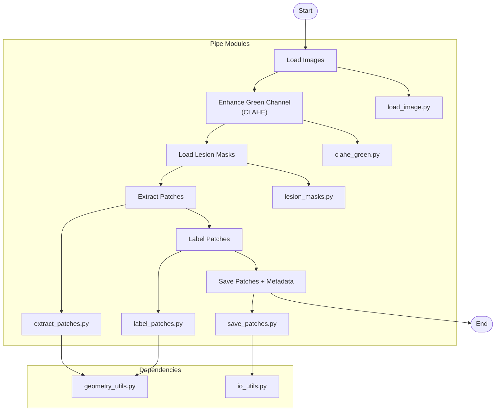

## Pipeline Overview

```mermaid
graph TD
  START([Start]) --> Load["Load Images"]
  Load --> Green["Enhance Green Channel<br>(CLAHE)"]
  Green --> Masks["Load Lesion Masks"]
  Masks --> Extract["Extract Patches"]
  Extract --> Label["Label Patches"]
  Label --> Save["Save Patches + Metadata"]
  Save --> END([End])

  subgraph Pipe Modules
    Load --> P1[load_image.py]
    Green --> P2[clahe_green.py]
    Masks --> P3[lesion_masks.py]
    Extract --> P4[extract_patches.py]
    Label --> P5[label_patches.py]
    Save --> P6[save_patches.py]
  end

  subgraph Dependencies
    P4 --> GU[geometry_utils.py]
    P5 --> GU
    P6 --> IO[io_utils.py]
  end
```
