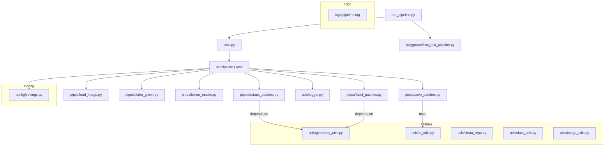

```mermaid
graph TD
A[run_pipeline.py] --> B[core.py]
A --> C[playground/run_test_pipeline.py]

B --> D[DRPipeline Class]
D --> P1[pipes/load_image.py]
D --> P2[pipes/clahe_green.py]
D --> P3[pipes/lesion_masks.py]
D --> P4[pipes/extract_patches.py]
D --> P5[pipes/label_patches.py]
D --> P6[pipes/save_patches.py]

P4 -->|depends on| U1[utils/geometry_utils.py]
P5 -->|depends on| U1
P6 -->|uses| U2[utils/io_utils.py]

D --> S[config/settings.py]
D --> L[utils/logger.py]

subgraph Utilities
U1
U2
U3[utils/clean_repo.py]
U4[utils/data_utils.py]
U5[utils/image_utils.py]
end

subgraph Config
S
end

subgraph Logs
LOG[logs/pipeline.log]
end
```
